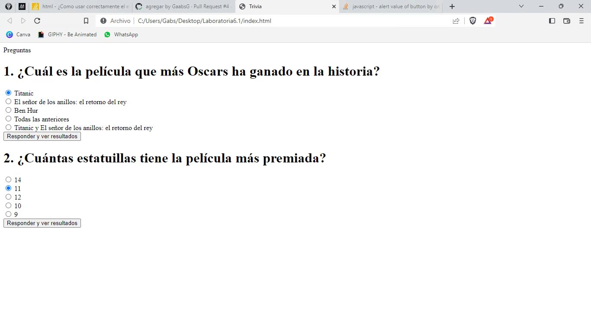
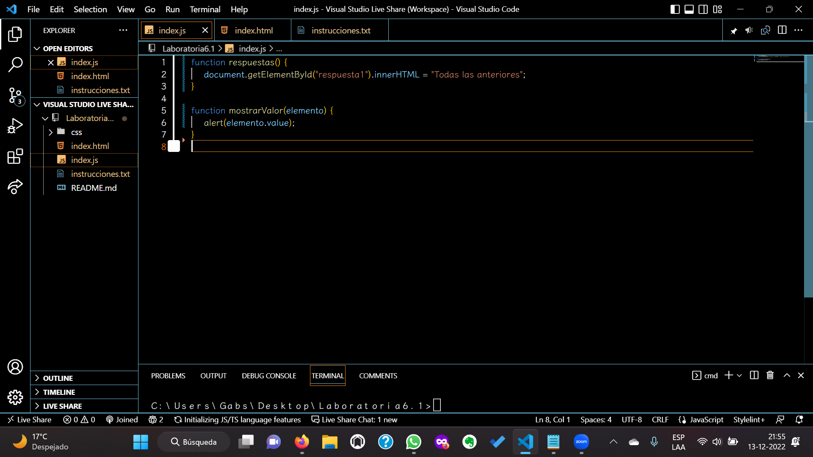

 

<h1 align="center"><b>Proyecto Pre-Admisión  
 Laboratoria</b></h1>
<h2 align="center">Triada 6.1</h2>

<b>Autoras</b>
 

[Gabriela Gomez](https://github.com/GaabsG)
 
[María Isabel Durango](https://github.com/MariaIsaDurango)
 
[María-Fernanda Villalobos](https://github.com/MariferVL)

 

  

       

     
    <a href="https://github.com/MariferVL/Laboratoria6.1"><strong>Acceso a Documentos »</strong></a>
     
     <a href="https://marifervl.github.io/Laboratoria6.1/"><strong>Acceso a Despliegue »</strong></a>
     
 
  

 

  
Indice

  <ol>
    <li>
      <a href="#acerca-del-proyecto">Acerca del Proyecto</a>
      <ul>
        <li><a href="#lenguaje-de-programación">Lenguaje de programación </a></li>
      </ul>
    </li>
    <li><a href="#aprendizaje">Aprendizaje</a></li>
    <li><a href="#video.demo">Video Demo</a></li>
    <li><a href="#referencias">Referencias</a></li>
  </ol>

  

## Acerca del Proyecto

 
Como parte del proceso de Pre-Admisión, en este proyecto construimos una aplicación Web sobre Trivias. Nuestra app cuenta con temática de cine y música.
Por medio de este proyecto tuvimos una primera experiencia desarrollando aplicaciones Web que interactúen con las usuarias a través del navegador, utilizando HTML, CSS, Boostrap y JavaScript.
Parte del proceso creativo se enfocó en la experiencia para nuestros usuarias, la responsividad para cada pantallas, el flujo, los mensajes, colores, etc.

### Lenguaje de programación

- [Javascript](https://www.javascript.com/)

### Framework

- [Bootstrap](https://getbootstrap.com/)

<a href="#volver">Volver</a>

  

## Aprendizaje

  
Durante la estructuración y creación de este proyecto logramos<b> adquirir conocimientos</b>  en las siguientes temáticas:

  <ul>
  <li> Html </li> 
    <ul>
      <li><a> - [x] Uso de HTML semántico </a></li>
        <ul>
          <li><a> HTML semántico </a></li>
          <li><a> Semantics - MDN Web Docs Glossary </a></li>
        </ul>
    <li><a> - [x] Uso de selectores de CSS </a></li>
      <ul>
        <li> <a> Intro a CSS </a></li>
        <li> <a> CSS selectors - MDN </a></li>
      </ul>
    </ul>
   
  <li> Webb APIs </li>
    <ul>
      <li><a> - [x] Uso de Selectores del DOM </a></li>
        <ul>
          <li> <a> Manipulación del DOM </a></li>
          <li> <a> Introducción al DOM </a></li>
          <li> <a> Localizando elementos DOM usando selectores - MDN </a></li>
        </ul>
    <li><a> - [x] Manejo de eventos del DOM (listeners, propagación, delegación) </a></li>
      <ul>
        <li><a> Introducción a eventos - MDN </a></li>
        <li><a> EventTarget.addEventListener() - MDN </a></li>
        <li><a> EventTarget.removeEventListener() - MDN </a></li>
        <li><a> El objeto Event </a></li>
      </ul>
    <li><a> - [x] Maipulación dinámica del DOM </a></li>
      <ul>
        <li><a> Introducción al DOM </a></li>
        <li><a> Node.appendChild() - MDN </a></li>
        <li><a> Document.creteElement() - MDN </a></li>
        <li><a> Document.createTextNode() - MDN </a></li>
        <li><a> Element.innerHTML() - MDN </a></li>
        <li><a> Node.textContent - MDN </a></li>
      </ul>
       </ul>
     
  <li> Javascript </li>
    <ul>
      <li><a> - [x] Tipos de datos primitivos </a></li>
        <ul>
          <li><a> Valores Primitivos - MDN </a></li>
        </ul>
      <li><a> - [x] Strings (cadenas de caracteres) </a></li>
        <ul>
          <li><a> Strings </a></li>
          <li><a> Strings - Cdena de caracteres - MDN </a></li>
        </ul>
      <li><a> - [x] Variables (declaración, asignación, ámbito) </a></li>
        <ul>
          <li><a> Valores, tipos de datos y operadores </a></li>
          <li><a> Variables </a></li>
        </ul>
      <li><a> - [x] Uso de condicionales (if-else, switch, operador ternaro, lógica booleana) </a></li>
        <ul>
          <li><a> Estructurs condicionales y repetitivas </a></li>
          <li><a> Tomando decisiones en tu código - condicionales - MDN </a></li>
        </ul>
      <li><a> - [x] Funciones (params, args, return) </a></li>
        <ul>
          <li><a> Funciones (control de flujo) </a></li>
          <li><a> Funciones clásicas </a></li>
          <li><a> Arrow Functions </a></li>
          <li><a> Funciones - bloques de código reutilizables - MDN </a></li>
        </ul>
      <li><a> - [x] Uso de identificadores descripptivos (Nomenclatura y semántica) </a></li>
         
       </ul>
    <li> UX (User eXperience) </li>
      <ul>
        <li><a> - [x] Diseñar la aplicación pensando en y entendiendo al usuario </a></li>
        <li><a> - [x] Crear prototipos para obtener feedback e iterar </a></li>
      </ul>
  </ul>

   
   
   

## Proyecto

  
<b>Hito 1</b>

  <ul>
    <li><b></b>1 sola pantalla o vista.</li>
    <li><b></b>2 preguntas con, al menos, 3 alternativas de respuesta cada una. </li>
    <li>1 botón para responder y ver cuál es la alternativa correcta.</li>
    <li>No te dice si acertaste o no, sólo te dice cuál alternativa era la correcta.</li>
    <li>Solamente el "esqueleto" estático.</li>
    <li>Dos preguntas con sus respectivas alternativas de respuesta en forma de /radio buttons/. (🔘)</li>
    <li>Botón para <b>“Responder y ver resultados”</b>.</li>
    <li>Mostrar un mensaje de alerta (/alert/) en el navegador que contenga el valor (texto) del /radio button/ cliqueado.</li>
    <li>Que esta vez solamente se marque el /radio button/ seleccionado y que el mensaje /alert/ con los valores de los /radio button/ seleccionados se muestre cuando al hacer /click/ en el botón “Responder y ver resultados”.</li>
</ul>
  

  
  
    

 

  
<b>Hito 2</b>

  <ul>
    <li>Una caja de texto (input text) en la que escribe su nombre quien juega.</li>
    <li>Agrega una pantalla simple de bienvenida.</li>
    <li>Un botón de "jugar" o "comenzar" para ir a las preguntas.</li>
    <li>Esta vez deberán haber al menos 3 preguntas con sus respectivas alternativas de respuesta.</li>
    <li>Antes de las peguntas debe decir "Hola [el nombre que se escribió en la pantalla de bienvenida]".</li>
    <li>Botón para responder muestra alternativa correcta para cada pregunta y, además, muestra si cada una de las respuestas fue correcta o incorrecta.</li>
 <li>Botón para volver a jugar que vuelve a la pantalla inicial en la que se pide el nombre.</li>
<li>Determinar si las respuestas seleccionadas son correctas o incorrectas, necesitas predefinir cuál alternativa es la correcta para cada pregunta y evaluar (comparar) si la respuesta de tu usuaria coincide o no.</li>
<li>Identificar elementos HTML que hay en el navegador y obtener sus valores/estados.</li>
<li>Comparar valores/estados de elementos y hacer algo según resultado que obtengas de la comparación/evaluación.</li>
  </ul>
    

  

   
 

 
 
  

  
<b>Hito 3</b>

  <ul>
    <li> Permitir a usuaria elegir entre 2 tipos de preguntas después de escribir su nombre y antes de ir a responder.</li>
    <li>Agrega puntaje a respuestas correctas e incorrectas y muestra un puntaje total al final.</li>
  </ul>
  

  

  
  

  

 

  
<b>Hacker Edition</b>

  <ul>
    <li>Agregar una cuenta regresiva con un tiempo límite para responder cada pregunta.</li>
    <li>Subir código a GitHub.</li>
    <li>Usar Boostrap.</li>
    <li>Crear una página web responsiva.</li>
  </ul>

 

  
  

 

 

<a href="#volver">Volver</a>

 

## Video Demo

https://user-images.githubusercontent.com/99364311/208135177-795d5c58-2de1-4a78-87f0-fa1f2673b495.mp4

 

## Referencias

- [Sololearn](https://www.sololearn.com/learning/1024)
- [StackOverflow](https://stackoverflow.com/)
- [W3Schools](https://www.w3schools.com/)
- [DjangoGirls](https://tutorial.djangogirls.org/es/)

<a href="#volver">Volver</a>

